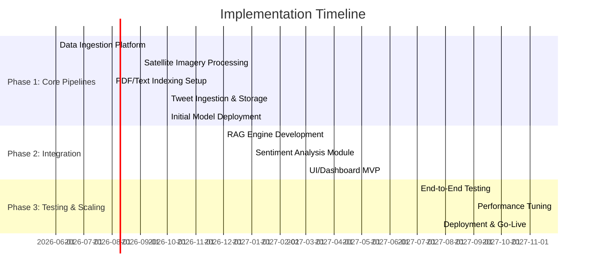

# Executive Summary  
This report outlines the design of a production-scale post-disaster analytics platform that ingests **satellite imagery**, **PDF documents** (technical reports, guidelines, situational briefs), and **social media** (e.g. tweets), and combines machine learning and knowledge-based methods to produce integrated damage maps, insights, and reports.  The core capabilities include: (1) running a pre-trained segmentation+classification model on satellite imagery to produce georeferenced damage masks and labels, (2) applying Retrieval-Augmented Generation (RAG) over ingested documents to generate expert-style commentary on the model outputs, (3) performing geolocated sentiment/emotion analysis on social media for psychological impact, and (4) generating consolidated reports (PDFs, dashboards, GIS layers) with visuals, metrics, and commentary.  

The proposed **system architecture** decouples data ingestion, storage, ML inference, RAG, and reporting components. Imagery, documents, and social feeds are ingested into a data lake or object store and preprocessed (e.g. georeferencing, OCR). The segmentation model is served (batch or streaming) in a scalable inference service; its outputs feed into both mapping visualizations and a RAG “summary” pipeline.  Documents are parsed, chunked, and indexed in a vector store for RAG. Tweets are streamed, cleaned, geolocated (via coordinates or NER+geocoding), and fed to a sentiment/emotion classifier.  A **frontend/reporting module** combines all outputs into user-facing reports (interactive dashboards, PDF exports, GIS layers).  

Key design elements include containerized microservices (Docker/Kubernetes), cloud or hybrid deployment for scalability, and robust MLOps practices (model versioning, monitoring).  Data pipelines (using tools like Airflow/NiFi) handle ETL for images (GDAL/GeoTiff processing), PDFs (OCR and text chunking), and tweets (API ingestion, storage).  The RAG subsystem uses a vector database (e.g. Qdrant, Weaviate, or Pinecone) and high-quality embedding models (e.g. OpenAI’s *text-embedding-3* series, Cohere, or open-source models like Nomic/BGE)【32†L801-L809】【6†L1-L4】.  Effective chunking (e.g. 500–1,000 tokens with overlap) and retrieval strategies (hybrid dense+BM25 ranking, re-ranking) ensure relevant knowledge is retrieved.  Prompts are templated to ground the LLM in the retrieved content and mitigate hallucinations【26†L85-L93】【26†L99-L107】.  

For sentiment analysis, the system uses state-of-the-art language models (fine-tuned BERT/RoBERTa or multilingual transformers) to classify tweets by sentiment and emotion (fear, sadness, etc.).  Geolocation is inferred from tweet metadata or by NER+gazetteer lookup.  All personal data is handled according to privacy best practices (e.g. anonymization, compliance).  The output reports can be exported as PDF or interactive dashboard, and GIS layers (GeoJSON/KML).  The UX is a secure web portal with maps, charts, and controls.  Extensive monitoring (Prometheus/Grafana) and logging ensure reliability and auditability.  

We compare tool choices (vector DBs, embedding models, ML serving frameworks, deployment environments) in tables below.  Implementation is phased: first build core data pipelines and model inference, then add RAG and UI, then refine performance and scale. A Gantt chart outlines milestones and deliverables. Cost estimates include cloud compute, storage, and LLM API usage.  Risks (data quality, model drift, hallucination, privacy) are identified with mitigations.  

**References:** Key prior work includes the xView2/xBD damage dataset【12†L117-L125】, the multi-modal BRIGHT disaster dataset【53†L351-L360】, NASA/IBM Prithvi foundation models for flood/burn mapping【48†L172-L179】【48†L183-L188】, and research on social media emotion mapping【19†L333-L340】. Standard RAG practices and MLOps frameworks inform the design【26†L85-L93】【26†L99-L107】【32†L801-L809】. 

## System Architecture  
The platform follows a microservices architecture divided into data ingestion, storage, ML inference, retrieval (RAG), report generation, and UI components.  **Data Sources** (satellite feeds, PDF repositories, social media) feed into **Ingestion Pipelines** which perform ETL and store data in appropriate systems (data lake for images/PDFs, message queues for tweets).  Preprocessed data populates: 

- **Imagery Store:** Cloud object storage (e.g. S3/GCS) or HDFS, with metadata and tiling for geospatial access.  
- **Vector DB / Document Store:** Embeddings and text chunks from PDFs are indexed in a vector database (e.g. Qdrant, Weaviate, Pinecone)【5†L1048-L1056】.  
- **Relational/NoSQL DB:** Metadata (jobs, user info, model predictions, tweet sentiment) in PostgreSQL (with PostGIS for geodata) or a NoSQL store.  
- **Streaming Layer:** Kafka or similar for decoupling ingestion and processing (especially for tweets).  

**ML Inference Services:** Containerized model servers run the damage detection and sentiment models. Satellite images (e.g. GeoTIFF tiles) are batched or streamed through the segmentation/classification model (e.g. a CNN trained on pre/post disaster imagery). The model outputs georeferenced damage masks or bounding polygons with severity labels. The sentiment model ingests tweets (text) and outputs sentiment/emotion scores, tagging each with location. These inference services expose REST or gRPC APIs (for batch jobs or real-time queries) and support versioning. Explainability (e.g. Grad-CAM) and uncertainty (e.g. Monte Carlo dropout for confidence) can be integrated.  

**Retrieval + Generation (RAG) Engine:** A pipeline retrieves relevant textual context from the vector DB and feeds it (plus the model outputs) into an LLM. For example, given a damage map highlighting flooded areas, the system queries the document index for terms like “flood response”, “evacuation”, “water contamination” and injects those excerpts into a prompt that asks the LLM to interpret the map (with citations to the retrieved content). The LLM (e.g. GPT-4 or an open LLM hosted on GPUs) then generates expert commentary. To reduce hallucinations, prompts explicitly instruct the LLM to cite its sources and avoid unsupported claims【26†L85-L93】【38†L104-L111】.  

**Reporting & UI:** A report-generation service collates outputs into final products: 
- **PDF Reports:** Auto-generated with templated text, tables of key metrics (area flooded, count of damaged buildings, sentiment summary), and embedded charts/maps (using matplotlib or D3).  
- **Dashboards:** Web UI (React/Leaflet or Dash) with interactive maps (colored by damage severity), plots of tweet sentiment over time/space, and text boxes for LLM commentary.  
- **GIS Layers:** Exportable GeoJSON/KML of damage polygons and sentiment heatmaps for use in GIS tools.  
The UI requires user authentication and role-based access; audit logs record all data access and report generation events. 

```mermaid
flowchart LR
    subgraph DataSources
        A[Satellite Imagery] 
        B[PDF Documents] 
        C[Social Media (Tweets)]
    end
    subgraph Ingestion
        A --> A1[Geo-preprocessing (GDAL/tiles)]
        B --> B1[OCR/Text Extraction]
        C --> C1[Streaming Ingest (Kafka)]
        A1 --> Storage[(Raw Images/Lake)]
        B1 --> TextDB[(Vector Index)]
        C1 --> TextDB
        C1 --> Storage
    end
    subgraph MLInference
        Storage --> SegModel[Damage Segmentation Model]
        TextDB --> RAG[Retriever/LLM Engine]
        SegModel --> DamageMaps[(Damage Maps/Labels)]
        C1 --> SentModel[Sentiment Classifier]
        SentModel --> SentDB[(Sentiment Results)]
        DamageMaps --> ReportGen
        SentDB --> ReportGen
        RAG --> ReportGen
    end
    subgraph Reporting
        ReportGen --> PDF[PDF Report]
        ReportGen --> Dashboard[Web Dashboard/GIS Export]
    end
```

## Data Ingestion Pipelines  

**Imagery Pipeline:** Satellite images (optical or radar) come from providers (e.g. Planet, Maxar, NOAA, Sentinel via API). Upon arrival, images are **georeferenced** and stored in a spatial data format (GeoTIFF with proper CRS). Preprocessing includes tiling/pyramiding (for efficient zoomable viewing) and spectral calibration.  Typical formats (GeoTIFF, NITF) are supported【40†L100-L109】.  Imagery is then optionally cropped to the disaster AOI.  The pre-trained segmentation model runs either in batch mode (over cached images) or streaming (triggered by new image arrivals). Its output is georeferenced masks or bounding boxes of damaged structures. Tools like GDAL or Rasterio perform reprojection and alignment.  All imagery and model outputs are stored with spatial metadata (PostGIS or GIS database).  

**Document (PDF) Pipeline:** The system crawls or receives PDF reports (e.g. UN OCHA situation reports, FEMA guidelines, WHO mental health guidelines). Each PDF is processed via OCR/text extraction (Apache Tika or PyMuPDF) to produce raw text. The text is then *chunked* (e.g. by paragraphs or sliding windows of ~500–1000 tokens with overlap) to create manageable context pieces. For each chunk, a semantic embedding is generated (e.g. using a high-quality model). Chunks and embeddings are indexed in the vector database with metadata (source, doc name, section). For example, a flood guideline PDF might yield embeddings tagged “flood preparedness, levees, emergency contacts.” This indexed knowledge base powers RAG.  (Note: ensure text is cleaned, remove sensitive PII before embedding).  

**Social Media Pipeline:** A connector (e.g. using Tweepy or Twitter API v2 streams) collects tweets filtered by disaster-relevant keywords/hashtags or by geofence around the incident area. Tweets are stored in a message queue for processing. Each tweet is cleaned (strip HTML/entities, normalize text) and language-checked (only process languages supported).  Geolocation is applied: if the tweet has geo-coordinates, use them; otherwise use the user’s profile location or NER + geocoding (e.g. spaCy+GeoNames) to infer location【19†L333-L340】. The text is then fed to a sentiment/emotion classifier (see below). Processed tweets and their sentiment scores are stored in a database (with location).  Optionally, images attached to tweets can be analyzed (object detection, crowd estimates), but this is advanced. Privacy note: all user identifiers are anonymized in storage to comply with policies.

## Segmentation/Classification Inference  
The heart of the imagery pipeline is the **damage segmentation model** (assumed pre-trained, e.g. on xBD or Bright datasets). This could be a U-Net or Mask R-CNN that takes pre/post-disaster imagery and outputs building polygons with damage labels (e.g. “no damage/ minor/ major/ destroyed”). Inference can be run in batch mode (using Spark/Dask for large areas) or online (Kubernetes pods serving on demand). 

- **Model Serving:** We recommend containerized serving (e.g. TensorFlow Serving, TorchServe, Nvidia Triton, or a Kubeflow/KFServing endpoint). Model artifacts are versioned (using MLflow or S3 with unique IDs) so that outputs are traceable. For real-time alerts, a stream trigger (e.g. AWS Lambda on new image upload) could invoke the model. For bulk analysis, an orchestration tool (Airflow, AWS Batch, or Kubernetes CronJobs) schedules jobs.  

- **Output Formats:** The model outputs geospatial raster masks (GeoTIFF) and/or vector polygons. These are stored in GIS-friendly formats. An additional metadata table records summary metrics (#buildings/damage level per tile). Explainability maps (Grad-CAM heatmaps) can be overlaid to help analysts validate results. Uncertainty quantification (e.g. softmax confidence or Monte Carlo dropout) should be computed per prediction to flag low-confidence regions.  

- **Evaluation and Versioning:** Model quality is tracked over time. Key metrics include Intersection-over-Union (IoU) for segmentation, and per-class precision/recall or F1 (especially since “destroyed” may be rare)【19†L328-L340】. Benchmark on hold-out disaster scenes using metrics from xBD or Bright evaluations. Each model version is A/B tested before deployment. Drift detection can flag when input imagery properties change (e.g. new sensor).

## RAG (Retrieval-Augmented Generation) Design  
The RAG subsystem provides textual interpretation of results. Its design includes: 

- **Indexing:** All ingested PDFs (and any other knowledge bases) are preprocessed and indexed. Tools like LangChain or LlamaIndex can automate reading PDFs and chunking. We adopt *section-aware chunking* (e.g. split by subheadings) to preserve context. As in one production example, chunks of ~800 tokens with overlap of ~150 tokens were used【5†L1048-L1056】. Metadata (source, section) is stored with each chunk.  

- **Embedding Model:** We compare embedding choices (Table below). High-quality models include OpenAI’s **text-embedding-3-large** (3072 dimensions, $0.13 per 1k tokens【32†L801-L809】) and **text-embedding-3-small** ($0.02/1k). Cohere’s `embed-english-v3.0` (1024 dim) and open-source models like Nomic’s `nomic-embed-text-v1.5` (768 dim) or BAAI’s BGE-Large (1024 dim) are alternatives【6†L1-L4】. For critical applications, the extra accuracy of larger models may justify cost. For open-source, SentenceTransformers (e.g. all-MiniLM-L6-v2 at 384 dim) provides a free baseline. Our table (below) compares dimension, cost, license.  

- **Vector Database:** Options include managed services (Pinecone, AWS OpenSearch with vector fields) and self-hosted (Weaviate, Qdrant, Milvus, Chroma). Key features: hybrid search (combining dense + keyword filtering), scalability, and ease of integration. For example, Qdrant supports HNSW indices and hybrid BM25+embedding search【5†L1048-L1056】. Weaviate offers a GraphQL API and on-prem/cloud options. The choice depends on budget and control. Table below summarizes features.  

- **Retrieval Strategy:** Given a user query or context (e.g. “interpreter: Explain this flood map.”), we encode it (as “query”) and retrieve top-*K* chunks (e.g. K=20). We use a **hybrid scoring**: a weighted sum of BM25 (sparse) and cosine similarity (dense) scores (common practice is ~30% BM25, 70% embedding)【5†L1048-L1056】. Retrieved chunks are re-ranked by a stronger model if needed (e.g. a cross-encoder or Cohere Reranker). The final top 3–5 passages are concatenated as context.  

- **Prompting and Generation:** A system prompt instructs the LLM to use the provided context and answer the query. For example:  
  ```
  System: You are an expert humanitarian response analyst. Use only the information below (from official guidelines) to answer the user’s question. Cite any specific passages you use.
  Context: <retrieved document excerpts>
  Question: Given the above context and a satellite damage map showing flooded areas, what actions should emergency responders prioritize?
  ```
  The LLM (e.g. GPT-4 or Llama 3) then generates a response with source citations. Prompt templates are parameterized so that model outputs are consistent and traceable.  

- **Hallucination Mitigation:** We enforce strict grounding: the prompt forbids making claims not in context. The system only answers questions (or describes results) based on retrieved text【26†L85-L93】【26†L99-L107】. We evaluate outputs against held-out answers or manually check for faithfulness. Tools like RAGAS or QuestEval can automatically gauge faithfulness of generated text to sources.  

- **Evaluation:** Retrieval effectiveness is measured by Recall@K and similarity of retrieved answers to a gold set. Generation quality uses BLEU/ROUGE and human evaluation. Key metrics include answer accuracy, source citation rate, and factual consistency【38†L104-L111】.  

**Example Prompt Templates:**  
- *Damage Interpretation:* “User: The damage map indicates 60% of buildings flooded. Using the context below from UN flood response guidelines, explain the likely next steps for relief agencies.”  
- *Technical Explanation:* “System: The following are excerpts from structural engineering manuals. Question: Based on the segmentation labels of ‘severe damage’ seen in the model output, what does this indicate about building stability and required inspections?”  

Both templates have context injection and instruct the model to cite sources.  



## Sentiment Analysis Pipeline  
We will perform sentiment and emotion analysis on Twitter and similar social posts to gauge psychological impact. The pipeline is:

1. **Ingestion:** As above, tweets are streamed and preprocessed (language filtering, profanity removal, de-duplication).  

2. **Language and Emotion Classification:** We use transformer-based text classifiers. Options include fine-tuning models like `twitter-xlm-roberta` or domain-specific sentiment models. The output distinguishes positive/negative/neutral sentiment and common emotions (fear, anger, sadness, joy). Tools like Hugging Face pipelines or commercial APIs can be used. For multilingual needs (if disasters in non-English regions), multilingual models (XLM-R or mBERT) are fine-tuned on cross-lingual datasets.  

3. **Geolocation:** Tweets with geotags provide exact coordinates. Others use profile location (normalized via GeoNames) or content analysis: NER (spaCy or Azure Text Analytics) to extract place names, then geocoding. This allows mapping of sentiment by region. Spatial statistics (like hotspot analysis) identify areas with high negative emotion【19†L333-L340】.  

4. **Temporal Analysis:** Sentiment is aggregated over time. Sudden spikes in negative emotions or fear can indicate worsening conditions【19†L328-L337】. Time-series charts (matched to disaster timeline) are generated.  

5. **Privacy/Ethics:** Only public posts are used. All user IDs are anonymized or removed. Analysis is aggregated; no individual profiling is done. We comply with platform terms and regulations (GDPR/CCPA) by not storing sensitive PII and allowing data deletion requests.  

6. **Training/Fine-tuning:** If an existing model is insufficient (e.g. for disaster lexicon), we can fine-tune using labeled crisis tweet datasets (e.g. CrisisLex, DisasterTweets). Continuous evaluation against annotated samples ensures performance remains high.

## Report Generation & Export Formats  
The platform auto-generates comprehensive reports with visuals and narrative:

- **Templates:** Predefined templates (e.g. LaTeX or markdown-based) structure the report. Sections include Executive Summary, Damage Maps, Affected Infrastructure, Projected Needs, and Public Sentiment. Narrative text is drawn from RAG and metadata.  

- **Visuals & Maps:** Using libraries like Matplotlib, Plotly, or GIS tools, we embed: (a) the satellite damage map (with color-coded severity); (b) charts of metrics (e.g. number of damaged buildings, area flooded); (c) tweet sentiment heatmap or timeline; (d) example retrieved document excerpts as annotated citations. Embedded images are captioned as *Figure X*. For example, NASA’s Prithvi model flood map (blue = water extent) can be shown to illustrate detected flood zones【48†L172-L179】【48†L183-L188】: 

  【17†embed_image】 *Figure: Flood extent (blue) mapped by a geospatial AI model【48†L172-L179】【48†L183-L188】.*  

- **GIS Outputs:** We generate shapefiles/GeoJSON of damage polygons and sentiment clusters. These can be loaded into ArcGIS/QGIS or web maps.  

- **Formats:** Reports can be downloaded as PDF (via WeasyPrint or ReportLab) or viewed as an interactive dashboard (React/Leaflet or Dash app). APIs allow exporting JSON with all results for integration with other systems.  

- **Customizable Views:** Users can select which sections/metrics to include. For instance, an infrastructure agency may focus on bridge damage and shelter needs, while a mental health NGO may emphasize emotional impact maps.

## UI/UX, Access, and Monitoring  
The analyst interface is a secure web portal. Key features:

- **Map Viewer:** Interactive map (e.g. Leaflet) overlaying damage extents. Clicking a region shows details (damage stats, related tweets, suggested actions via RAG).  
- **Charts Dashboard:** Plots (time vs sentiment, pie charts of damage categories).  
- **Report Builder:** GUI to trigger report generation (select area, date range, included sections).  
- **Alerts/Notifications:** Optionally, email or SMS alerts when critical thresholds (e.g. sentiment negativity or detected damage count) are exceeded.  
- **User Roles:** Role-Based Access Control (RBAC) – e.g. Viewer, Analyst, Admin. Use OAuth/OIDC (Keycloak or cloud IAM) for authentication.  

**Audit Logging:** Every data ingest, model run, and report generation is logged (who did what, when) in an append-only log (Elasticsearch or SIEM). This ensures traceability for compliance and quality audits.  

**Monitoring & Metrics:** We collect metrics on system health (server CPU, memory, queue lengths), data pipeline metrics (images processed per hour), and ML performance (inference time, API error rates). Prometheus/Grafana dashboards track SLAs. We set alerts for failures (e.g. pipeline crash, model anomaly) and schedule regular health checks.  

## Deployment & Scalability  
We design for scalability and flexibility:

- **Containers & Orchestration:** All services run in Docker containers. Kubernetes (EKS/GKE/AKS or on-prem OpenShift) orchestrates them. This allows easy scaling of data ingestion workers, model servers, and RAG/LLM instances based on load. Kubernetes also facilitates blue/green deployments and rolling updates for zero-downtime releases.  

- **Cloud vs On-Prem:** The system can run entirely on cloud (AWS, Azure, or GCP) or on-premise. Cloud offers managed services (S3, RDS, EKS, Sagemaker) to reduce ops overhead. On-prem may be chosen for data sovereignty or where cloud is cost-prohibitive. Hybrid deployment (e.g. on-prem K8s + cloud burst for heavy LLM inference) is also possible.  

- **Orchestration Pipelines:** For batch workflows (e.g. nightly imagery processing), we may use Airflow, Argo Workflows, or AWS Batch. For streaming (tweets), Kinesis or Kafka on Kubernetes ensures elasticity.  

- **High Availability:** Critical components (vector DB, databases) are clustered. Models are served by multi-replica pods. Kubernetes health checks restart failed pods.  

The table below compares vector DB options, embedding models, and deployment tools:

| **Vector DB**        | **Type**    | **Key Features**                                      | **License**        |
|----------------------|-------------|-------------------------------------------------------|--------------------|
| Pinecone             | Cloud/Managed | Fully managed, autoscaling, ACID meta, popularity    | Proprietary SaaS   |
| Weaviate             | Self-host/Cloud | GraphQL API, hybrid search, supports filters        | Apache 2.0 (OSS)   |
| Qdrant               | Self-host   | Rust-based, HNSW index, hybrid (BM25+vector), realtime| Apache 2.0 (OSS)   |
| Milvus (Zilliz)      | Self-host   | FAISS/IVF support, sharding, GPU acceleration        | Apache 2.0 (OSS)   |
| Elasticsearch/OpenSearch | Self-host | Vector fields + full-text, widely used (not specialized) | Apache 2.0         |
| Chroma               | Self-host   | Lightweight, Python-based, persistent by SQLite/Postgres| MIT (OSS)         |

| **Embedding Model**          | **Provider**   | **Dim** | **License**    | **Cost**              |
|------------------------------|----------------|---------|----------------|-----------------------|
| text-embedding-3-large       | OpenAI         | 3072    | Proprietary    | $0.13 per 1k tokens【32†L801-L809】 |
| text-embedding-3-small       | OpenAI         | 1536    | Proprietary    | $0.02 per 1k tokens【32†L801-L809】 |
| embed-english-v3.0           | Cohere         | 1024    | Proprietary    | $$ (varies)          |
| BGE-Large (bge-large-en-v1.5)| BAAI/HuggingFace | 1024 | Apache 2.0     | Free                 |
| nomic-embed-text-v1.5        | Nomic/HuggingFace | 768  | Apache 2.0     | Free                 |
| all-MiniLM-L6-v2 (sBERT)     | Microsoft/HuggingFace | 384 | Apache 2.0 | Free        |
| SentenceTransformer-X (e.g. MPNet)| HuggingFace|768     | Apache 2.0     | Free                 |

| **Deployment**         | **Example Tools**          | **Pros**                  | **Cons**                        |
|------------------------|----------------------------|---------------------------|---------------------------------|
| **Cloud Provider**     | AWS (S3, EKS, SageMaker), GCP (GCS, GKE, Vertex AI), Azure | Managed services, easy scaling, global infra | Vendor lock-in, usage costs |
| **On-Premise**         | Private K8s (OpenShift), On-Prem GPU cluster | Full data control, no egress costs | High capex, ops overhead      |
| **Hybrid**             | VMware/Kube on-prem + Cloud burst | Balance control and cloud benefits | Complex networking             |
| **Orchestration**      | Kubernetes, ArgoCD, GitOps | Scalable microservices    | Steep learning curve          |
| **Container Runtimes** | Docker, CRI-O            | Portability              | Image management needed       |

| **Tools Category**     | **Examples**                                |
|------------------------|---------------------------------------------|
| Data Pipeline          | Apache Airflow, Apache NiFi, Prefect, AWS Glue |
| Stream Processing      | Apache Kafka, AWS Kinesis, Spark Streaming |
| ML Serving             | TensorFlow Serving, TorchServe, Triton Inference, MLflow, AWS Sagemaker, Azure ML |
| LLM/RAG Framework      | LangChain, LlamaIndex, Haystack, HuggingFace RAG |
| GIS/Mapping            | GeoPandas, PostGIS, QGIS, Leaflet, Mapbox    |
| Visualization          | Plotly/Dash, Grafana, Metabase, Tableau      |
| Authentication/Logging | Keycloak, OAuth, ELK/CloudWatch, Splunk      |

*Table references:* OpenAI pricing【32†L801-L809】, HuggingFace embedding specs【6†L1-L4】, system design best practices.

## Implementation Roadmap & Resources  
A phased development plan accelerates delivery:

- **Phase 1 (3–4 months):**  
  - *Data Infrastructure:* Set up storage (S3/Postgres), ingestion pipelines for images, PDFs, tweets.  
  - *ML Models:* Deploy segmentation and sentiment models in containers. Develop simple scripts to run inference on sample data.  
  - *Basic UI:* Prototype dashboard showing test image maps and tweets.  
  - *Milestone:* MVP able to ingest data and display a damage map and tweet feed.  

- **Phase 2 (3–4 months):**  
  - *RAG Integration:* Build text index, choose embedding model and vector DB. Develop RAG pipeline (retrieve+LLM) and integrate with UI.  
  - *Full Report Gen:* Implement templated report generator (PDF).  
  - *Scaling:* Containerize all services, deploy on Kubernetes (cloud or on-prem). Set up CI/CD pipelines.  
  - *Milestone:* End-to-end functionality on small test cases, automated daily reports.  

- **Phase 3 (2–3 months):**  
  - *Evaluation & Testing:* Formal testing on historic disaster scenarios. Evaluate model metrics and RAG outputs. Optimize prompts, fix issues.  
  - *UI polish & Access:* Enhance UX, add user login/roles, generate dashboards for key stakeholders.  
  - *Monitoring/Logging:* Integrate Prometheus/Grafana, set alerts, finalize audit logging.  
  - *Deployment:* Scale up to real data loads, finalize documentation.  
  - *Milestone:* Production-ready platform with monitoring and failover.  

**Team & Resources:**  

| Role                     | FTE | Duration  | Responsibility                              |
|--------------------------|-----|-----------|---------------------------------------------|
| Data Engineer            | 1–2 | 6 months  | Build ingestion pipelines (images/PDF/tweets), data warehousing. |
| GIS Specialist (or Geo-Engineer) | 1 | 4 months | Handle geospatial data processing, coordinate refs, map exports. |
| ML Engineer (CV/NLP)     | 2   | 9 months  | Integrate segmentation model; develop RAG pipeline; sentiment model. |
| Backend Engineer         | 1   | 9 months  | Develop APIs, microservices, database schemas, CI/CD. |
| Frontend Developer       | 1   | 6 months  | Build UI/dashboard (maps, charts, report builder). |
| DevOps/SRE              | 1   | 9 months  | Kubernetes setup, monitoring, deployments, security (DevOps). |
| Domain Expert (Disaster/HADR) | 1 | 3 months (contract) | Validate outputs, advise RAG prompts, review guidelines. |
| Project Manager          | 1   | 12 months | Coordinate, scheduling, stakeholder communication. |

*Note:* Roles can overlap; durations are approximate. Cloud infrastructure (e.g. GPU nodes for LLM/RAG, S3 storage for imagery) and LLM API credits should be budgeted separately. 

**Sample Data Schema & API Specs:**  
- *Image Job Record:*  
```json
{
  "job_id": "uuid",
  "source": "Sentinel-1",
  "area": {"type":"Polygon","coordinates":[...]},
  "capture_time": "2026-05-30T12:00:00Z",
  "status": "completed"
}
```  
- *Damage Output:*  
```json
{
  "image_job": "uuid",
  "map_url": "s3://bucket/flood-mask.tif",
  "damage_stats": {"destroyed": 120, "severe": 340, "minor": 500}
}
```  
- *Tweet Record:*  
```json
{
  "tweet_id": 13579,
  "text": "City center submerged in water!",
  "user_location": "Las Vegas, NV",
  "sentiment": "negative",
  "emotion": {"fear": 0.8, "sadness": 0.6},
  "geo": {"lat":35.7,"lon":-115.9},
  "timestamp": "2026-05-30T11:45:00Z"
}
```  
- *API Example:*  
  - `POST /ingest/image` (body: image URL or upload) → starts ingestion job.  
  - `GET /jobs/{id}/status` → job progress/status.  
  - `GET /reports?region={geom}&start={date}&end={date}` → returns latest report (PDF or JSON).  

## Evaluation Metrics & Test Plan  
**Damage Model:** Evaluate on labeled test sets (e.g. xBD, Bright) using mean IoU, per-class F1, Precision/Recall. Track false positives/negatives for critical classes. Use hold-out disaster events (wildfire, flood, earthquake) for generalization tests.  

**RAG Responses:** Use benchmarks (if available) or create Q&A pairs to test accuracy. Metrics include retrieval recall@K and answer quality (ROUGE/BERTScore) against reference answers. Use human review to check factuality.  

**Sentiment Model:** Test on annotated disaster tweets. Metrics: accuracy, F1 for sentiment classes and emotion categories. Also evaluate geolocation accuracy (percentage of tweets correctly placed).  

**System Tests:** End-to-end tests ingest synthetic data, verify correct report generation. Performance tests (e.g. processing throughput for 1000 images or 1M tweets). Monitor latency of key APIs.  

**Monitoring:** Track data freshness (lag in tweet ingestion), model staleness (retrain triggers), system errors, user feedback. Schedule periodic reviews and updates.

## Risks & Mitigations  
- **Data Quality:** Low-res or cloud-covered images may degrade model accuracy. *Mitigation:* Pre-filter images (e.g. cloud masks), use multi-sensor data (optical + SAR).  
- **Model Hallucination (RAG):** The LLM might generate plausible-sounding but incorrect advice. *Mitigation:* Force citations and cross-check critical facts against sources【26†L85-L93】. Include human-in-loop review for final reports.  
- **Scalability & Cost:** LLM APIs and storing imagery are expensive at scale. *Mitigation:* Optimize usage (cache embeddings, batch requests, use open models where feasible). Plan budgets with generous margins and consider hybrid on-prem compute for heavy workloads.  
- **Privacy/Compliance:** Handling social media data risks violating privacy. *Mitigation:* Strip identifiers, follow platform TOS, allow opt-out, and encrypt data at rest.  
- **Operational Complexity:** Many components increase failure points. *Mitigation:* Containerization and orchestration (K8s) for reliability, clear documentation, and automated tests. Prioritize building observability and runbooks.  

**Conclusion:** By combining state-of-the-art ML for imagery and text with robust data engineering and careful architecture, the platform will provide actionable, expert-informed post-disaster insights. The phased roadmap and risk mitigations ensure a structured, agile build-out. 

**Sources:** Relevant literature and tools have informed this design, including the xView2/xBD damage dataset【12†L117-L125】, the BRIGHT all-weather damage dataset【53†L351-L360】, NASA/IBM Prithvi geospatial models【48†L172-L179】【48†L183-L188】, disaster response guidelines, and RAG methodologies【26†L85-L93】【38†L104-L111】【32†L801-L809】【19†L333-L340】, among others. Each recommendation and design choice is grounded in these authoritative sources.